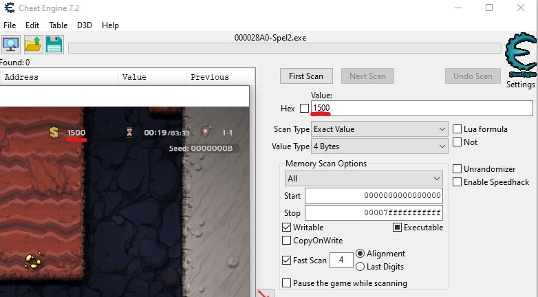
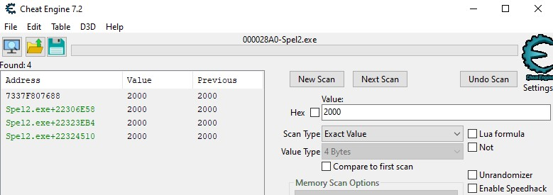
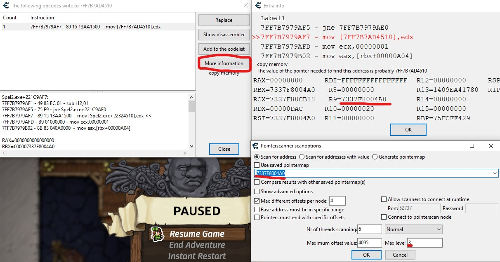
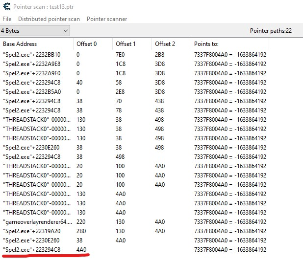

# Reverse Engineering

This guide aims to document how to reverse-engineer parts of Spelunky 2. In particular, this guide will illustrate how to get the memory offset values that JesterCap looks at in order to read whether the True Crown has been picked up.

## Cheat Engine

[Cheat Engine](https://www.cheatengine.org/) (abbreviated "**CE**") is a utility that allows you to attach to a running program and read or write its memory values. It's worth going through the first few stages of CE's included tutorial to familiarize yourself with the program. We'll be using CE for the entire process of reverse-engineering the game.

### Setup

For JesterCap, we will only be reading values from Spelunky 2 (as opposed to modifying process data). You will want to edit the CE settings to use page exceptions and the VEH debugger (under the Debugger Options section of the settings). Other exception types will cause crashes in Spelunky 2.

A "memory offset" refers to a particular location in memory. We are going to use CE to search for 2 offsets:

1. Score (extremely easy, comparable to the CE tutorial)
2. Game data structure (much harder, uses advanced CE functionality)

### Score Offset

We'll start by searching for an offset we can use to read the current score from Spelunky 2. To accomplish this, we're going to repeatedly change the value of our score (by picking up treasure in-game) and looking for memory values that consistently match our changing score value.

* Start up Spelunky 2 and begin a run.
    * I recommend using the seed `00000008`. This seed contains a guaranteed True Crown on 2-2 (assuming you complete Beg's quest on the previous levels).
* Ensure CE is set to use "page exceptions" (see "Setup" section).
* Attach CE to the Spelunky 2 process.
* Pick up some treasure in Spelunky 2 so that your score is not 0.
* Enter your score in the "Value" textbox. All other values can be left at their defaults.
    
* Click "First Scan". Lots of memory addresses will pop up in the pane to the left. We are going to filter these.
* Repeat the following steps until the pane only contains memory offsets which are changing with the score:
    * Change your score in Spelunky 2 (e.g. by picking up gold)
    * Enter your score into the "Value" textbox and click "Next Scan"
* Eventually you should be left with something like this:
    

Offsets are sometimes notated with a hexadecimal number after the process name. Here, the process name is `Spel2.exe` so we actually have 3 offsets to choose from.

We could technically use any of these 3 score offsets, since they all seem to update when gold is picked up. However, one of these offsets has a distinguishing feature that makes it slightly preferable: only one of these offsets actually updates when gold is picked up, while the others update every frame regardless of whether or not the score value was changed.

To find out when the memory values at these offsets get updated, right-click on the first offset and click "Find out what writes to this address". You'll notice one of two things:
1. The debugger will immediately pick up a write operation, and the count on the write operation will begin ticking up. This address is updating every frame, which is not what we want.
2. The debugger will not pick up any write operations until the score actually changes - one write operation per score change. This address is only updating when the score changes, which is what we want.

Because we are using page exceptions, you'll also note that Spelunky 2 is significantly more jittery while trying to play with the debugger attached.

Try all the offsets until you find the one that only updates on a score change. This address is our score offset.

*Note: if you try to give yourself infinite gold by editing this memory value, it won't work. This value is the final result of some larger calculation that is performed every time the score updates (as we will soon see).*

## Game Data Offset

At this point, we've found the following pieces of valuable information:
* Our score offset
* An "opcode" (machine code) instruction that writes to our score offset

Click "Stop" on the new window to detach the debugger from Spelunky 2, select the opcode instruction, and click "Show disassembler". A new CE window will pop up with a lot of terrifying machine code. Don't worry, you shouldn't need to interact with any of this.

When I was initially putting JesterCap together I spent a lot of time in the disassembler figuring out how this score value gets calculated. To make a long story short, the game tracks each player seperately, including how much gold each player has picked up and spent. Every time gold gets picked up, this calculation is performed again.

It turns out that when the opcode instruction is run, Register 9 (R9) contains an pointer to some of player 1's data. This pointer is not the same as an offset; the value of the pointer can change every time the program is run. However, there is a fixed offset somewhere that contains the value of this pointer. We need to use CE's [**Pointer Scan**](https://cheatengine.org/help/pointer-scan.htm) functionality to find it.

* Select the opcode instruction that writes to the score offset
* Click "More information" to open a window showing the state of every register when that instruction was executed
* Make a note of the value in the R9 register; it should end with `4A0`
* Click "Memory View," then go "Tools" > "Pointer Scan"
* Enter the value that was in the R9 register
    * Also, lower the "Max level" to 3 or 4 to filter out extremely long pointer paths. We're expecting a small pointer path (only 1 level).
        
* Click OK, then select somewhere to save the pointermap file.
* The pointer scan will run and spit out some "pointer paths" where this pointer was found. We want the path that only has one offset:
    

So what does this path actually represent?
* At `Spel2.exe` + `223294C8` (the base offset) there is a pointer value `7337F800000`
* Adding `4A0` (offset 0) to the pointer value gives `7337F8004A0` which is the value we scanned for

The base offset is the "Game Data Offset" that we were looking for.